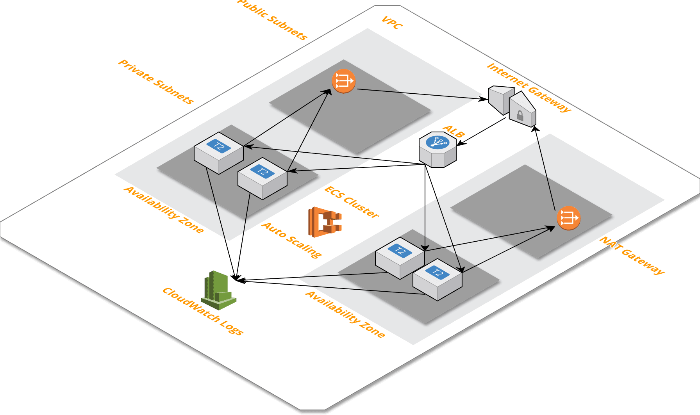
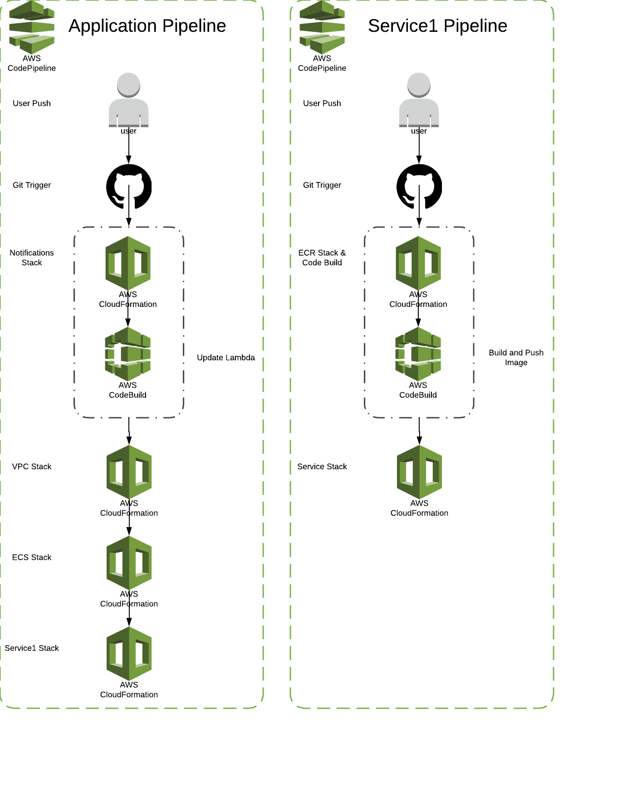
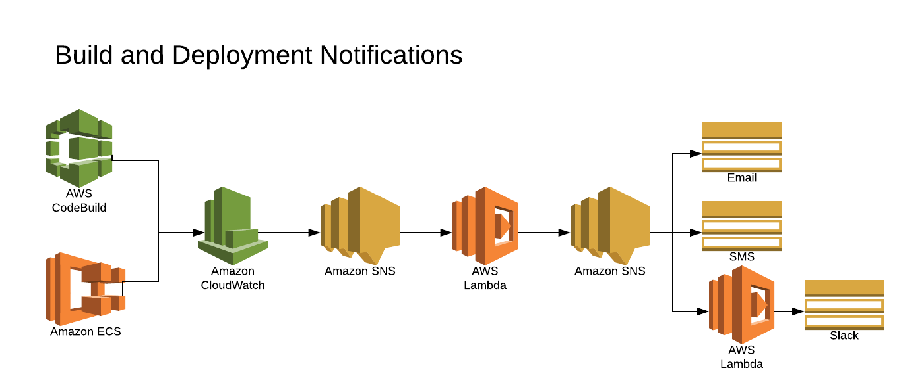

# Services CI/CD Stack
Create an ECS Microservices stack with built-in CI/CD for the Infrastructure (IaC) and Code.

With every code push your Infrastructure will be updates.  

With every code push a new version of your Service will be built, tested, and deployed (optional).

There are two environments `sandbox` and `prod`.  This makes it easy to test Infrastructure and Code changes before pushing to prod.

- sandbox -> `development` Git branch
- prod -> `master` Git branch

Sandbox builds are pushed live automatically.  

Production builds are pushed manually by updating the Infrastructure.

Build notifications and Deployment notifications are sent either as an email, sms message, and/or Slack message.

## Architecture

## CI/CD CodePipelines

## Notifications

## Setup
1. Fork and clone this repo.
2. Fork and clone the [service1-stack-cicd](https://github.com/thestackshack/service1-stack-cicd)
3. Install [CIM](https://github.com/thestackshack/cim) (CloudFormation Utility)
4. Install the [kms](kms/README.md) stack.
5. Create an EC2 keypair.
6. Install the [bootstrap.stack.yml](bootstrap.stack.yml) stack.

## Encrypt Secrets
In order to protect your configuration secrets like your GitHub token we need to create a KMS key first.

You can use the CloudFormation script in [kms](kms/README.md) or just create it via the console.

## EC2 Keypair
Use the console to create an EC2 keypair for all your EC2 instances.

## Stack Up
Create the [bootstrap.stack.yml](bootstrap.stack.yml) stack.  

First update [_cim.yml](_cim.yml) with your GitHub information and your EC2 keypair.  

Also take a look at the [vpc parameters](stacks/vpc/_cim.yml).  You might need to change the AvailabilityZones. 

This stack will build 2 pipelines:

1. Prod (master branch)
2. Sandbox (develop branch)

Each pipeline will execute the following steps every time you commit changes to this repo:

- Create/Update the [stacks/notifications/notifications.stack.json](stacks/notifications/notifications.stack.json) stack.
- Create/Update the [stacks/vpc/vpc.stack.json](stacks/vpc/vpc.stack.json) stack.
- Create/Update the [stacks/ecs.stack.yml](stacks/ecs.stack.yml) stack.
- Create/Update the [stacks/service1.stack.yml](stacks/service1.stack.yml) stack.

The [stacks/service1.stack.yml](stacks/service1.stack.yml) stack creates a pipeline that updates the infrastructure and code found in this repo: [service1-stack-cicd](https://github.com/thestackshack/service1-stack-cicd)